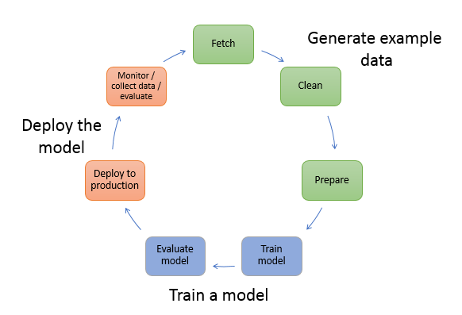

# Advanced ML Services
## Kendra
- Uses NLP and ML models to answers queries from your data
- Uses semantic and contextual understanding to decide if a document is relevant
- Types of queries:
	- Factoid questions: who, what, when or where
		- Where is the nearest service center to Seattle
	- Descriptive questions
		- How do I connect my Echo Plus to my network
	- Keyword and natural language questions
		- Keynote address
- Benefits
	- Simplicity
	- Connectivity
		- Third-party data sources/repositories such as MS SharePoint
	- Accuracy
	- Security

### Resources
- [AWS Documentation](https://docs.aws.amazon.com/kendra/latest/dg/what-is-kendra.html)

## Forecast
- Full managed
- Uses statistical and ML algorithms to deliver highly accurate time-series forecast
- Used in
	- Retail, finance, logistics and healthcare
	- Can be used to predict domain specific metrics such as workforce, server capacity, web traffic etc
- Common uses cases:
	- Retail demand planning – Predict product demand, allowing you to more accurately vary inventory and pricing at different store locations.
	- Supply chain planning – Predict the quantity of raw goods, services, or other inputs required by manufacturing.
	- Resource planning – Predict requirements for staffing, advertising, energy consumption, and server capacity.
	- Operational planning – Predict levels of web traffic, AWS usage, and IoT sensor usage.
- Features
	- Automated ML
	- State of the art algorithms
	- Missing value support
	- Additional built-in datasets

### Resources
- [AWS Documentation](https://docs.aws.amazon.com/forecast/latest/dg/what-is-forecast.html)

## SageMaker
- Fully managed ML service
- Allows to build, train, deploy ML models into production ready environments
- Can store and share your data without having to build and manage your own servers
- Provides managed ML to run efficiently on extremely large dataset

### Features:
- Autopilot: Users without machine learning knowledge can quickly build classification and regression models.
- Ground Truth: High-quality training datasets by using workers along with machine learning to create labeled datasets.
- Feature Store: A centralized store for features and associated metadata so features can be easily discovered and reused.
- Data Wrangler: Simplify and streamline data pre-processing and feature engineering using little to no coding
- Preprocessing: Analyze and preprocess data, tackle feature engineering, and evaluate models.
- SageMaker Clarify: Improve your machine learning models by detecting potential bias and help explain the predictions that models make.

### Workflow

### Resources
- [AWS Documentation](https://docs.aws.amazon.com/sagemaker/latest/dg/whatis.html)